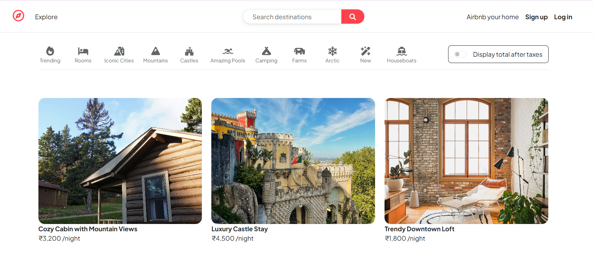
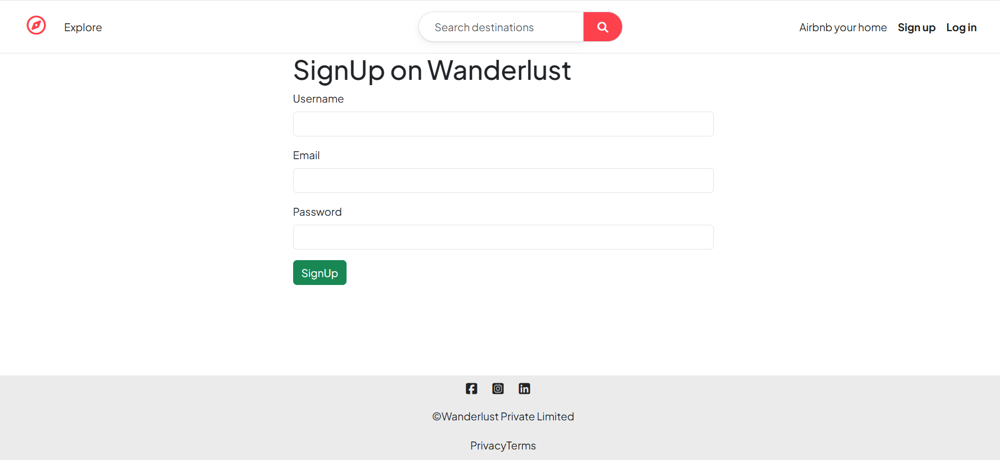
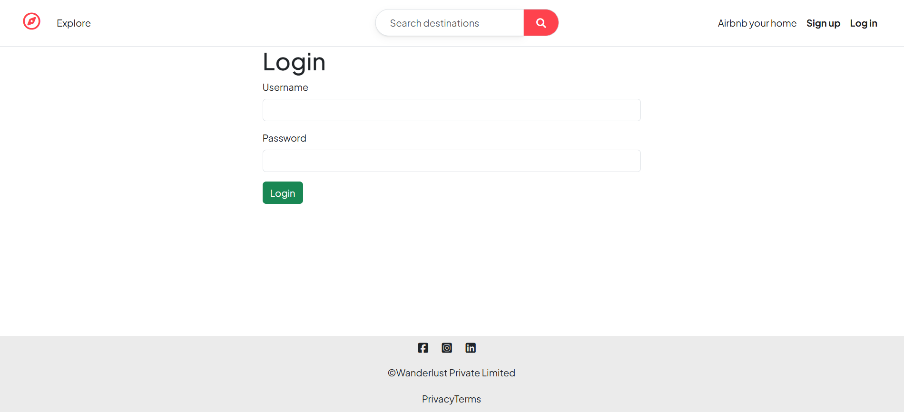
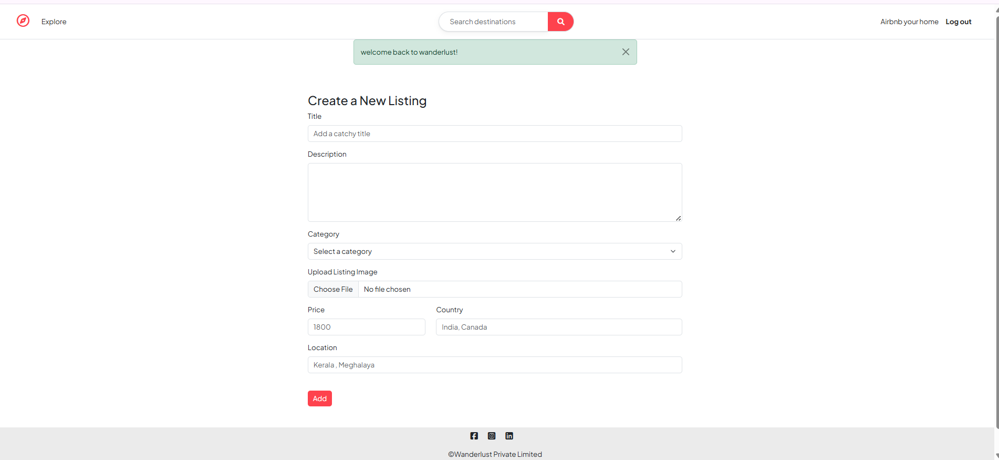

# Heavenly - Full Stack Accommodation Platform 

Welcome to **Heavenly**, a full-stack accommodation and property listing platform inspired by Airbnb. This project allows users to explore, list, and book properties with secure authentication, reviews, and location-based search.

---

## 💻 Tech Stack
- **Frontend:** HTML, CSS, JavaScript, Bootstrap, EJS  
- **Backend:** Node.js, Express.js  
- **Database:** MongoDB, Mongoose  
- **Authentication:** Passport.js  
- **Image Storage:** Cloudinary (via Multer)  
- **APIs:** Mapbox Geocoding API  
- **Validation:** Joi (server-side), Bootstrap (client-side)  
- **Session Management:** Express Sessions  
- **Architecture:** MVC (Model-View-Controller) with modular routing  

---

## 🔑 Key Features

- **User Authentication & Authorization**  
  - Secure login & signup using Passport.js  
  - Password hashing and salting  
  - Authorization checks for editing/deleting listings  

- **Listings Management**  
  - Create, update, and delete listings  
  - Upload listing images via Cloudinary  
  - Listings include title, description, price, location, country, and category  

- **Reviews & Ratings**  
  - Users can post reviews and ratings  
  - Reviews linked to the listing and author  
  - Only authors can edit/delete their reviews  

- **Map Integration**  
  - Accurate location mapping using Mapbox Geocoding API  

- **Search & Filter Functionality**  
  - Filter listings by category  
  - Search by location with MongoDB indexing  

- **Validation**  
  - Client-side: Bootstrap  
  - Server-side: Joi schemas  

- **Responsive Design**  
  - Fully responsive across mobile, tablet, and desktop  
  - Clean and minimal UI  

- **Session Management**  
  - Persistent sessions using Express Sessions  

- **MVC Architecture & Modularization**  
  - Separate folders for controllers, models, views, and routes  
  - Scalable and maintainable code  

---

## 📷 Screenshots

### Homepage

### Signup Page

### Login Page

### Create Listing

---

## 🧠 What I Learned
- Real-world full-stack development  
- Backend architecture & database design  
- Authentication & authorization flows  
- Integrating third-party APIs (Mapbox, Cloudinary)  
- Server-side and client-side validation  
- Building a fully responsive UI  
- Using MVC architecture for modular, clean code  
- Production-style deployment considerations  

---

## 🔗 Live Demo
https://heavenly-pw7s.onrender.com/listings

---
